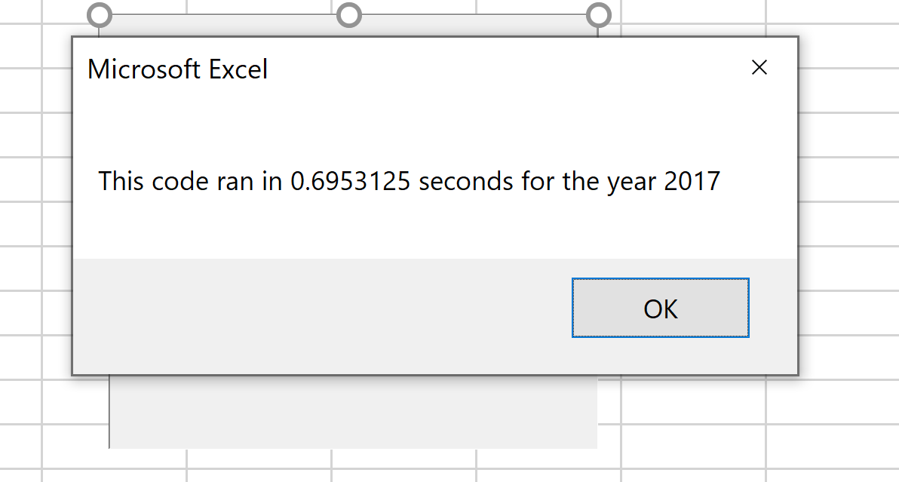
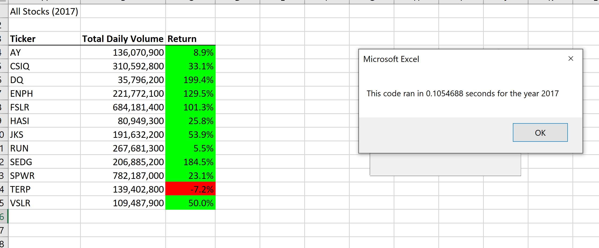
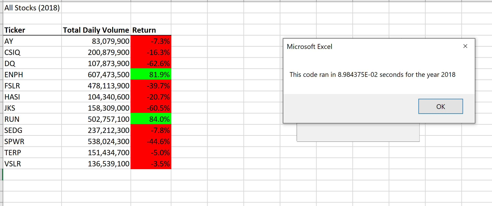

# Kickstarting with Excel

## Overview of Project
The project is created in order to analyze the stock market for a client Steve. The code should analyze and compare the stock prices at the beginning and the end of the year. The  old code has been presented but it's not effective for a significant amount of data.

### Purpose
To optimize and refactor old code so it would run faster and allow it to work with massive amounts of data.

## Analysis and Challenges
The main task is to find ineffective pieces of code and refactor them.

### Refactoring
At the beginning the variable "tickerIndex" was created to access the correct index. Then three output arrays were created: "tickerVolumes", "tickerStartingPrices", and "tickerEndingPrices" that optimize index' reading. Those are the main changes that allow code to run faster. Then we run through the spreadsheet using loops and if statement as in original code and the job is done

### Challenges and Difficulties Encountered
The main challenge is that the code gets bigger and in the end some minor mistakes prevented it from running so I speeded some time on debugging.

## Results
After the refactoring the code runs much faster with the same output the original code produced.
The old code runs for 0,7 seconds for both years and the new code does the same job for 0.1 sec for 2017 year and even faster for 2018 years 0,09 sec which shows us that the optimization increases the timing in 7 times which significantly saves time during analyzing the big missives of data. While refactoring is more time consuming and makes the code missive and more complicated it will save time in the future saving time on waiting while the code is executed.

OLD CODE

NEW CODE

